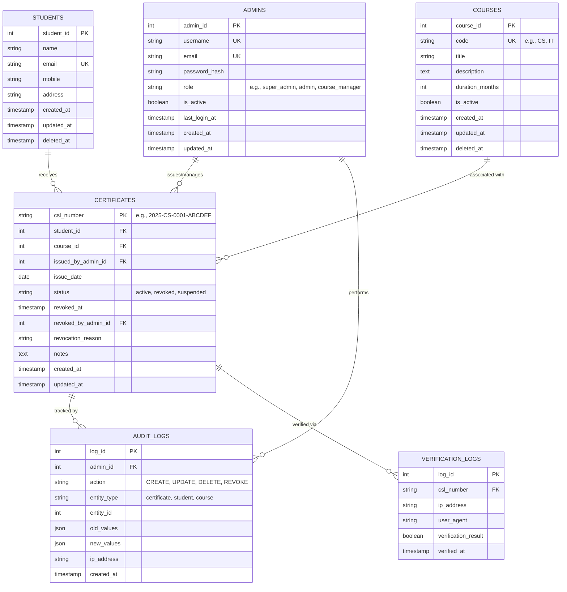

# CSL Management System - ER Diagram

## Entity Relationship Diagram (Mermaid Format)



## Entity Descriptions

### ADMINS
Stores administrative user accounts with role-based access control.
- **Primary Key**: admin_id
- **Unique Constraints**: username, email
- **Roles**: super_admin (full access), admin (standard), course_manager (limited)

### STUDENTS
Maintains student records for certificate issuance.
- **Primary Key**: student_id
- **Unique Constraints**: email
- **Soft Delete**: Uses deleted_at for data retention

### COURSES
Course catalog for certificate programs.
- **Primary Key**: course_id
- **Unique Constraints**: code
- **Business Logic**: Each course has a unique 2-letter code for CSL generation

### CERTIFICATES
Core entity storing issued certificates with unique CSL numbers.
- **Primary Key**: csl_number (format: YYYY-CC-NNNN-VVVVVV)
- **Foreign Keys**: student_id, course_id, issued_by_admin_id
- **Status Values**: 
  - active: Valid certificate
  - revoked: Cancelled certificate
  - suspended: Temporarily invalid

### AUDIT_LOGS
Tracks all critical system operations for compliance and debugging.
- **Purpose**: Maintain audit trail for regulatory compliance
- **Retention**: Permanent storage

### VERIFICATION_LOGS
Records all public verification attempts.
- **Purpose**: Monitor verification patterns and detect fraud attempts
- **Retention**: 2 years minimum

## Relationships

1. **One-to-Many Relationships**:
   - One ADMIN can issue many CERTIFICATES
   - One STUDENT can receive many CERTIFICATES
   - One COURSE can have many CERTIFICATES
   - One ADMIN can perform many AUDIT_LOGS actions
   - One CERTIFICATE can have many VERIFICATION_LOGS

2. **Cardinality**:
   - ADMINS to CERTIFICATES: 1:N (one admin issues multiple certificates)
   - STUDENTS to CERTIFICATES: 1:N (one student can have multiple certificates)
   - COURSES to CERTIFICATES: 1:N (one course can have multiple certificates issued)

## Indexes Strategy

```sql
-- Performance indexes
CREATE INDEX idx_certificates_student_id ON certificates(student_id);
CREATE INDEX idx_certificates_course_id ON certificates(course_id);
CREATE INDEX idx_certificates_issue_date ON certificates(issue_date);
CREATE INDEX idx_certificates_status ON certificates(status);
CREATE INDEX idx_audit_logs_admin_id ON audit_logs(admin_id);
CREATE INDEX idx_audit_logs_created_at ON audit_logs(created_at);
CREATE INDEX idx_verification_logs_csl_number ON verification_logs(csl_number);
CREATE INDEX idx_verification_logs_verified_at ON verification_logs(verified_at);
```

## Constraints

1. **Foreign Key Constraints**: All FKs use ON DELETE CASCADE for students/courses, SET NULL for admins
2. **Check Constraints**: 
   - status IN ('active', 'revoked', 'suspended')
   - email format validation
   - CSL number format validation
3. **Unique Constraints**: Prevent duplicate emails, usernames, course codes

## Data Integrity Rules

1. Certificate cannot be issued without valid student and course
2. CSL number must be unique across all time
3. Revoked certificates must have revocation timestamp and admin
4. Sequential number resets annually per course
5. Verification hash validates using server-side pepper
