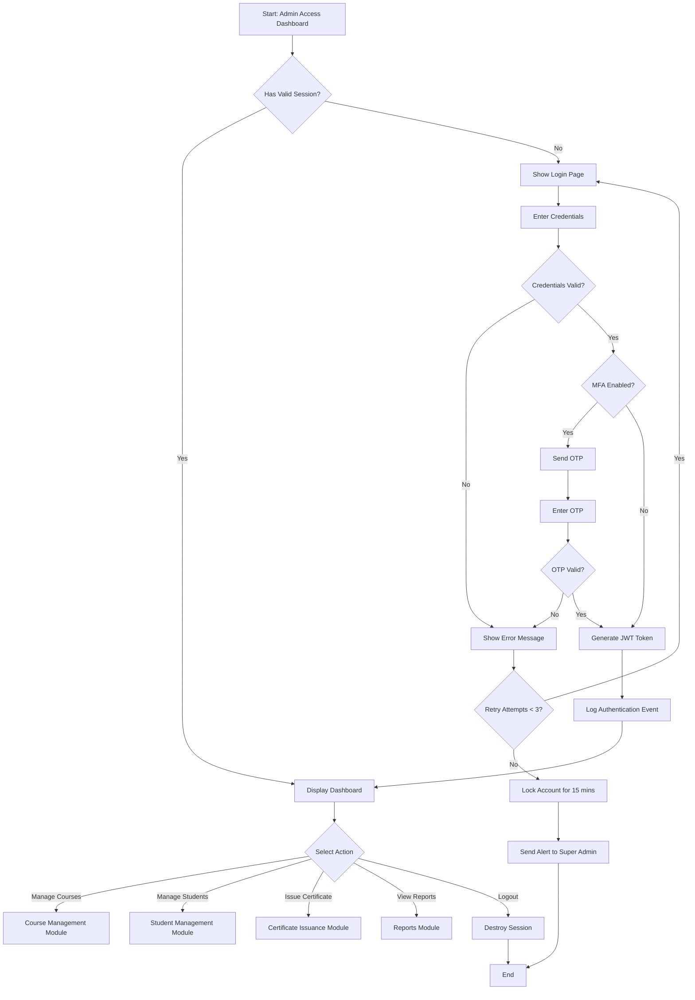
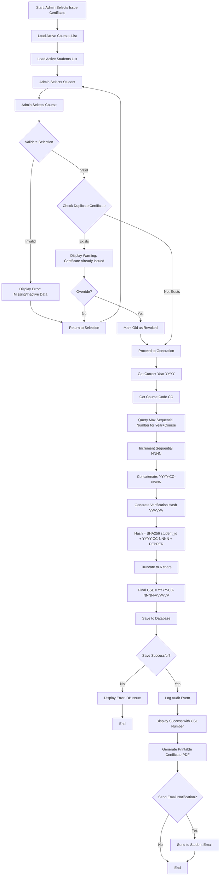
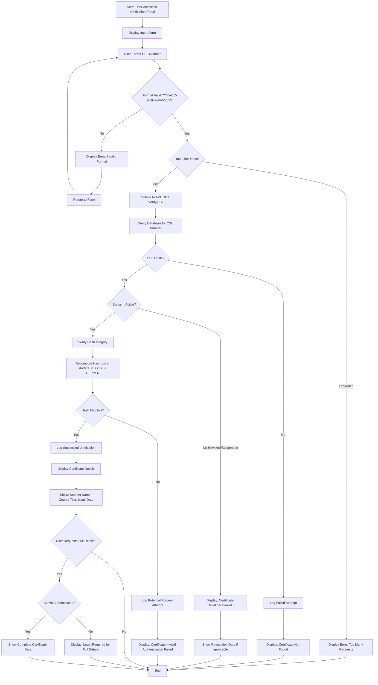
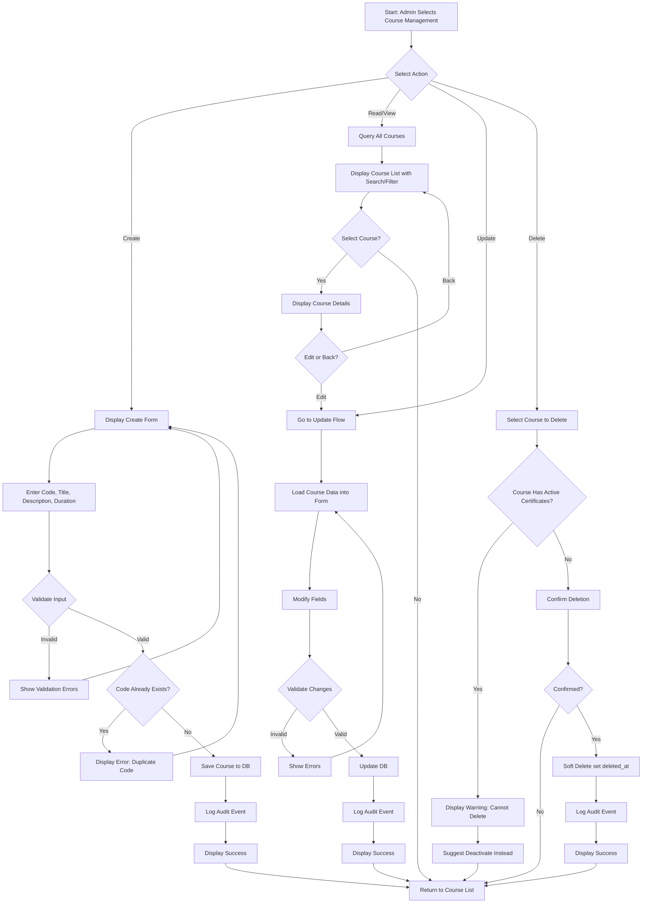
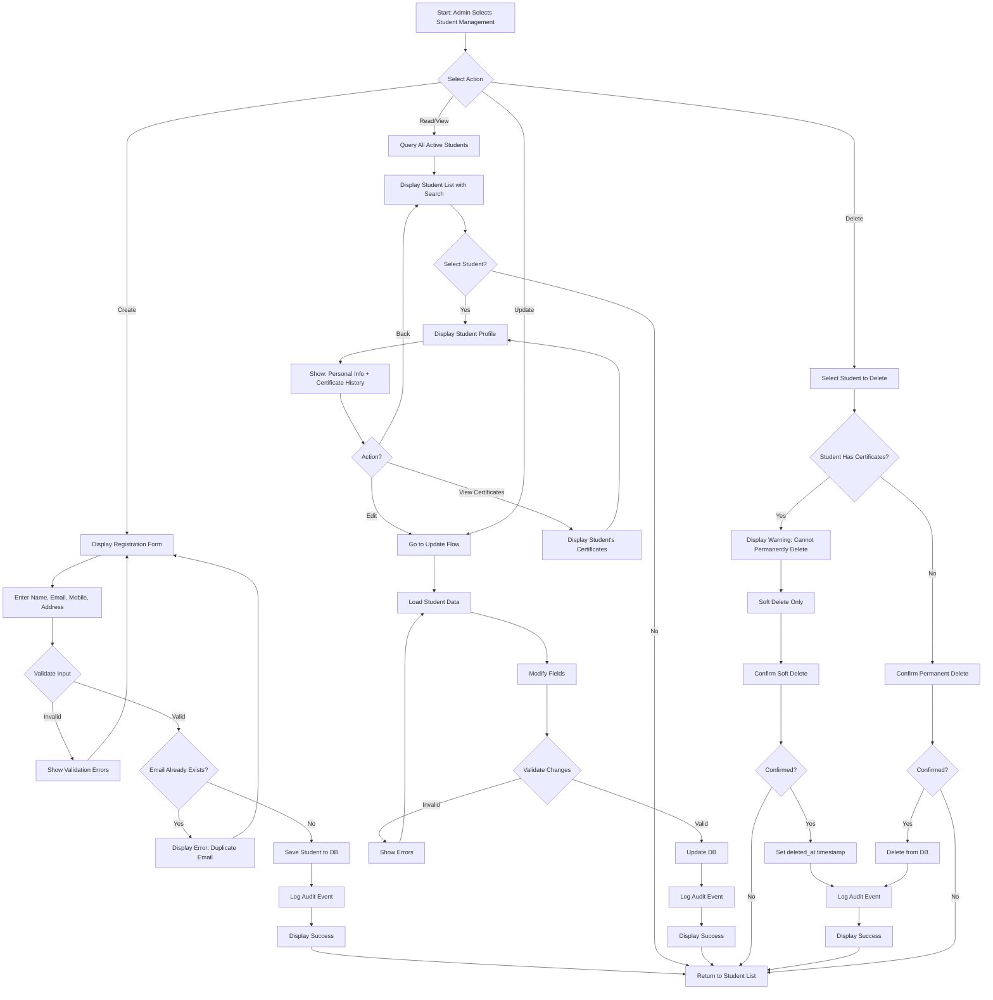
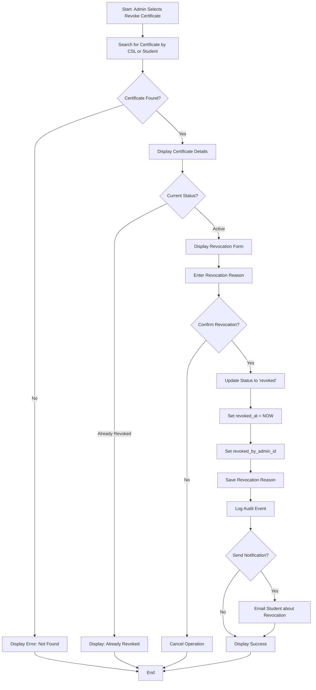
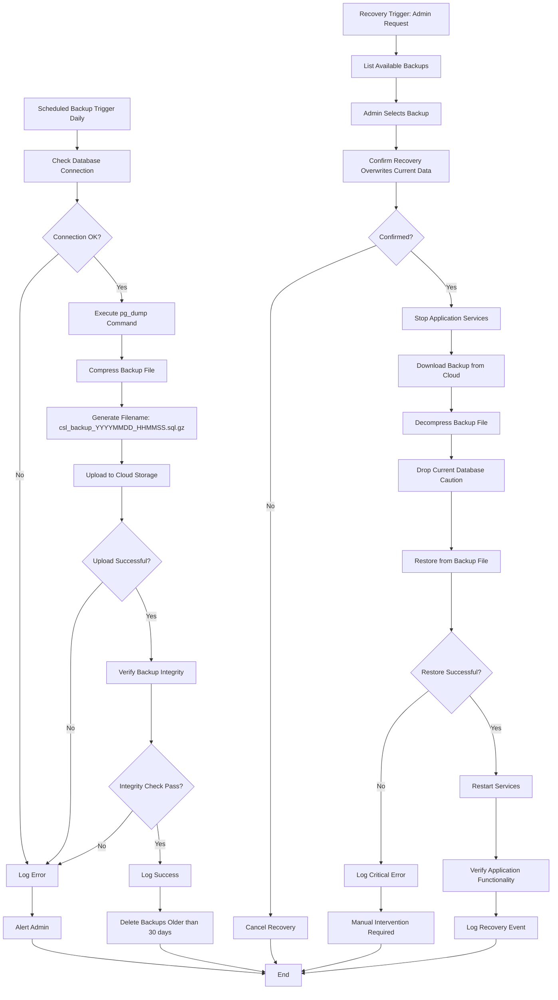

# CSL Management System - Flow Charts

## 1. Admin Authentication Flow

## 2. Certificate Issuance Flow

## 3. Public Certificate Verification Flow

## 4. Course Management CRUD Flow

## 5. Student Management CRUD Flow

## 6. Certificate Revocation Flow

## 7. System Backup and Recovery Flow

## Flow Chart Legend

- **Rectangle**: Process/Action
- **Diamond**: Decision Point
- **Parallelogram**: Input/Output
- **Rounded Rectangle**: Start/End
- **Arrow**: Flow Direction

## Notes

1. All flows include audit logging for compliance
2. Error handling returns user to safe state
3. Rate limiting prevents abuse on public endpoints
4. MFA adds security layer for admin authentication
5. Soft deletes preserve data integrity
6. Backup strategy ensures 30-day retention minimum
